# Stock Analysis using News and Twitter data
## **Purpose**
This projects aims to use Python to analyze stock price behaviors, and explore relationships between stock price and public opinions (such as news and tweets) about a company.

### **Data sources and methods**:
1. web scrape public news headlines about any stock from Business Insider
     * **NOTE**: the last time I tested the news program was on Dec 12 2020, I realized Business Insider website was down, the same url that used to work cannot be loaded in a regular web browser.
     * If the news extraction takes a really long time for you to test, please use my sample news files that have been provided inside the zip file (you need to change the file date to ***today*** to make it work - please see more instructions in the section '**Sample Data File Usage**'). 
2. extract tweets about a company for the past 8 days, through Twitter API and tweepy
     * Twitter API can be really slow. It can take 5-10mins to import a stock's tweets.
     * You may want to use my sample tweet data files - please see more instructions in the section '**Sample Data File Usage**'.
3. extract a stock's historical price data between any 2 dates through a yahoo finance's hidden API
4. web scrape a public company's profile and basic statistics from Finviz

### **Data file format**:
All data will be saved in csv.

### **Outcome**:
The project displays an interactive menu to allow any user to choose what aspect of information about a stock he/she wants to see. Users can select to either explore one stock or to compare several stocks (5 max) at a time.
<br/><br/>


## **Modules used in the project**
* `colored`
* `datetime` 
* `requests`
* `time` 
* `re` 
* `string` 
* `pandas` 
* `numpy` 
* `matplotlib` 
* `os` 
* `bs4` 
* `statsmodels`
* `tweepy`
* `urllib` 
* `textblob`
* `nltk`
* `en_core_web_sm`
* `wordcloud`
<br/><br/>

## **Modules installation instructions**
Use the package manager [pip](https://pip.pypa.io/en/stable/) to install:

```bash
pip install colored
pip install requests
pip install pandas
pip install numpy
pip install matplotlib
pip install bs4
pip install statsmodels
pip install tweepy
pip install textblob
pip install nltk
pip install wordcloud
```

To install `en_core_web_sm`:

```bash
pip install spacy
python -m spacy download en_core_web_sm
```
<br/><br/>

## **Usage**
1. Install all the required modules if you have not done so.

2. There are 7 python files (.py) in the folder:
    * group11_main.py
    * stock_profile.py
    * stock_price.py
    * stock_news.py
    * stock_twitter.py
    * sentiment_analysis.py
    * word_cloud.py

4. Open **`group11_main.py`** in **Spyder**, and start running the program

5. Follow the menu instructions that will be displayed in the console to explore.
<br/><br/>
## Project menu breakdown

```bash
Main Menu
├── 1. Pick only one stock to explore
│   ├── 1. Company overview                 
│   │
│   ├── 2. Stock price movement   
│   │        ├── 1. Plot closing price and trading volume   
│   │        ├── 2. Plot closing price simple moving average   
│   │        ├── 3. Add more tickers to compare price   
│   │        ├── H. Back to the main menu   
│   │        ├── M. Back to the one stock exploration menu   
│   │        └── Q. Exit  
│   │
│   ├── 3. News analysis   
│   │        ├── 1. Display the most recent 10 news headlines
│   │        ├── 2. Plot closing price vs news sentiment   
│   │        ├── 3. Display new sentiment model summary on closing price   
│   │        ├── 4. News word cloud
│   │        ├── 5. Add more tickers to compare news sentiment   
│   │        ├── H. Back to the main menu   
│   │        ├── M. Back to the one stock exploration menu   
│   │        └── Q. Exit                                   
│   │
│   ├── 4. Twitter analysis over past 8 days  
│   │        ├── 1. Plot twitter sentiment over past 8 days   
│   │        ├── 2. Plot closing price vs twitter sentiment over past 8 days   
│   │        ├── 3. Twitter sentiment model summary on price over past 8 days   
│   │        ├── 4. Tweet word cloud
│   │        ├── 5. Add more tickers to compare twitter sentiment  
│   │        ├── H. Back to the main menu   
│   │        ├── M. Back to the one stock exploration menu   
│   │        └── Q. Exit                          
│   │
│   ├── H. Back to the main menu
│   │
│   └── Q. Exit    
│                 
│                                       
├── 2. Pick multiple stocks (up to 5) to compare     
│   ├── 1. Compare price movement 
│   ├── 2. Compare news sentiment
│   ├── 3. Compare twitter sentiment over past 8 days
│   ├── H. Back to the main menu 
│   └── Q. Exit      
│                                       
│
└── Q. Exit                                                                    
```
<br/><br/>

## **Example about how to use this program**
First, press start to run the file `group11_main.py` in **Spyder**.
<br/><br/>

Home menu will be displayed in the console like below: 

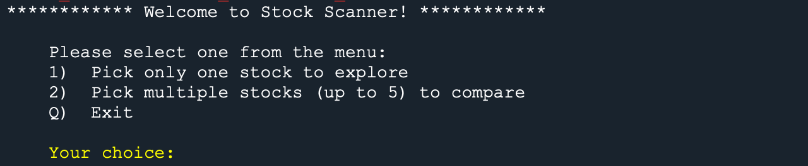
<br/><br/>

If you enter **1**, a new menu will be display:

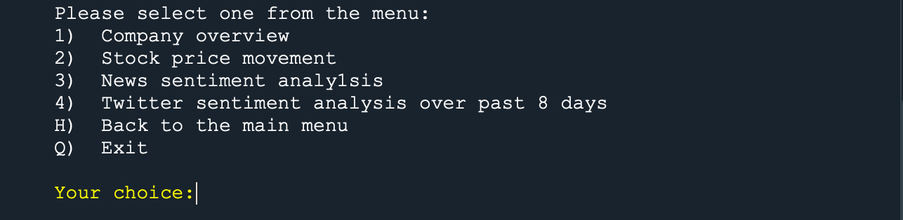
<br/><br/>

If you enter **1** to see **Company overview**, the program will ask you to enter a valid ticker. Here I entered **GOOGL**, and then 
the company's basic info and statistics this ticker represents will be displayed, and followed by more menu options.

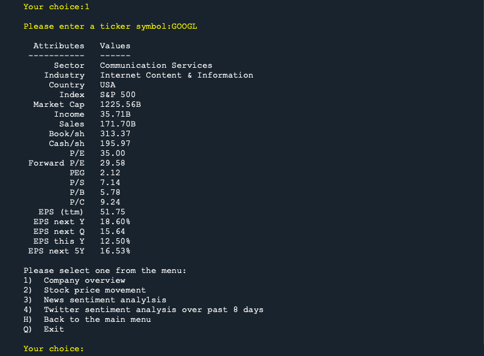
<br/><br/>

If you enter **2**, the program will ask you the start date and end date in *yyyy-mm-dd* format for the price inquiry of **GOOGL**. Here I entered **2020-05-01** for the start date, and **2020-12-07** for the end date. As you can see, there are lots of options for price related information.

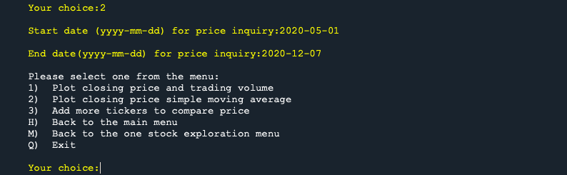
<br/><br/>

If you enter **1**, Google's closing price and trading volume movements between 2020-05-01 and 2020-12-07 will be displayed as two sub plots inside of one plot. Then more menu options will be displayed right after.

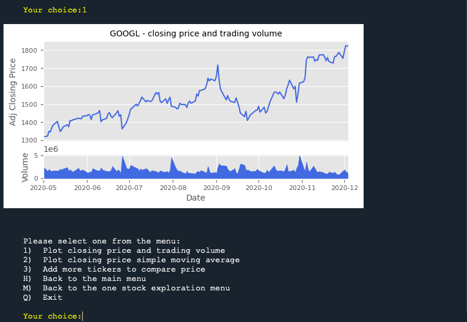
<br/><br/>

If you enter **M**, the program will direct you back to the main menu for one ticker exploration again, with the same options as you have seen before.

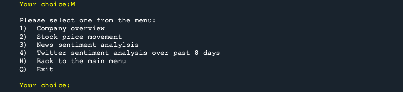
<br/><br/>

If you enter **H**, the program will direct you back to the home menu:

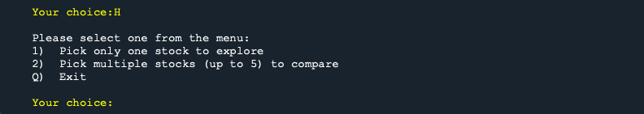
<br/><br/>

If you choose **2** this time. Now the program asks you the number of tickers you want to compare at a time, but **5** tickers at most. If you enter 7 by accident, an error message will pop up right away and ask you to correct your entries. If you make another mistake and enter 'GOOGL' this time, which is not even a number, and the program will yell at you again.

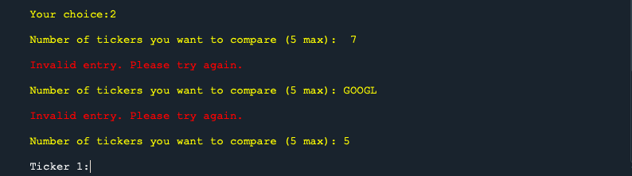
<br/><br/>

Until you finally enter a valid ticker size number, such as 5. Then the program will start asking you for all 5 ticker symbols.

Here you can see, if you meant to enter a ticker for company Amazon, instead of entering its ticker which should be AMZN, you ended up entering Amazon, the program notices the input is not a valid ticker, and it will ask you to enter again.

Meanwhile, the input for a ticker can be either lowercase, or uppercase, or mixed, as long as the input can represent a valid ticker:

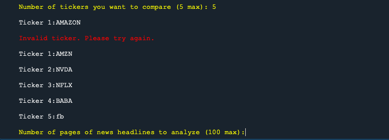
<br/><br/>

Now you need to enter the number of pages of news headlines you want to load to compare all these 5 tickers. Usually it is about 50 news headlines per page. If you enter 30, 30 pages of news headlines will be exported for all tickers one by one as you can see from the screenshot. 

The program loaded AMZN first, then NVDA, then NFLX, BABA and then finally FB. So you can get a sense about which step the program is at, just in case it takes longer to run certain task.

In the end, a plot about news polarity score comparison will be created for all 5 tickers. Based on its x-axis scale, we can see 30 pages of news from Business Insider means the date ranges from Sep 2020 to Dec 2020.

One thing to know about polarity score: -1 means extremely negative, and 1 means extremely positive.

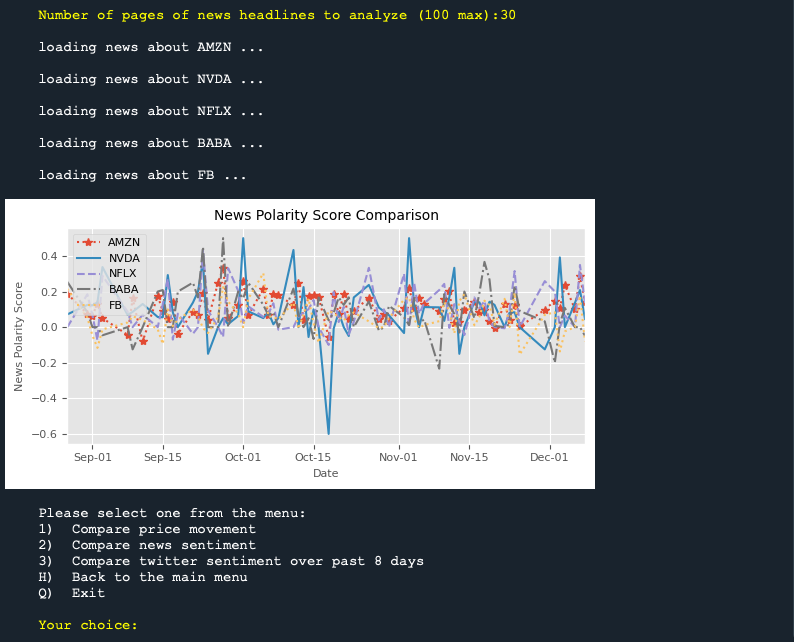
<br/><br/>

This time, if you want to see one stock's tweet sentiment movement over the past 8 days from the current menu, you can enter **H** to go back to the home menu, and then **1** to pick one single stock exploration menu, and then **4** for Twitter analysis. 

If you enter **Googl** again, more twitter related options will display like below:

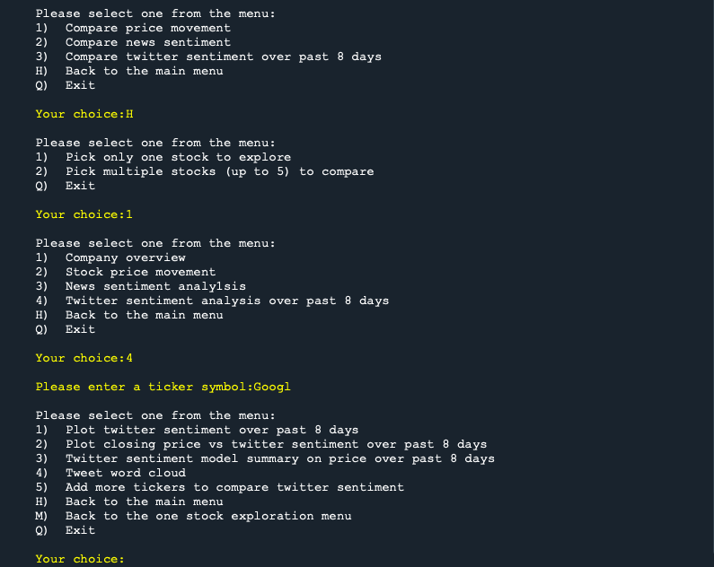
<br/><br/>

If you enter **1** to see Google's tweet sentiment score distribution over the past 8 days. In this example, we can see the negative score percentage increased a lot on Dec 03 2020 which dragged down the overall compound score by a lot, compared to other days. This change is consistent with the Google's recent anti-trust scandal.

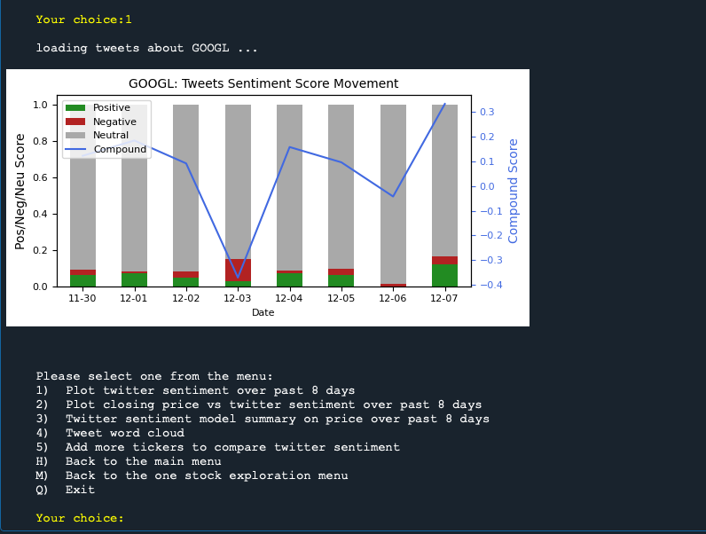
<br/><br/>

If you enter **3** to analyze the statistical significance of Google's tweet sentiment score on its closing price over the last 8 days, a statistical model summary based on Ordinary Least Squares (OLS) regression, and a plot about actual closing price vs OLS model price will be displayed.

More about OLS model: **Y** variable is the stock's adj closing price, **X** variables used are stock opening price and its daily average tweet compound sentiment score.

 In this example, we notice that recent tweets related to Google is not statistically significant based on its t-value, and R-square is not large enough to explain the closing price movement, which is not too surprising given the market reacts really quickly.

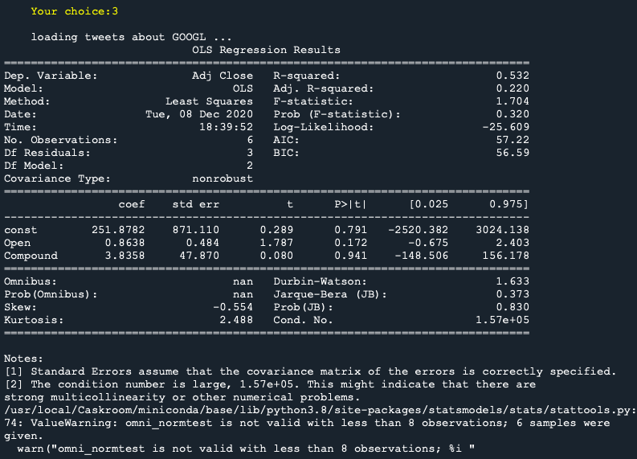
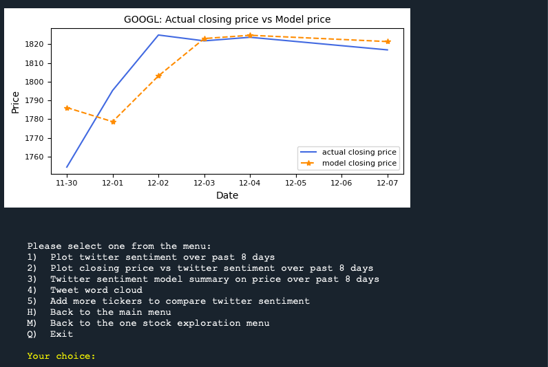
<br/><br/>

If you press **4** to see a word cloud about Google's recent tweets, an image with most frequent keywords about Google will be displayed:

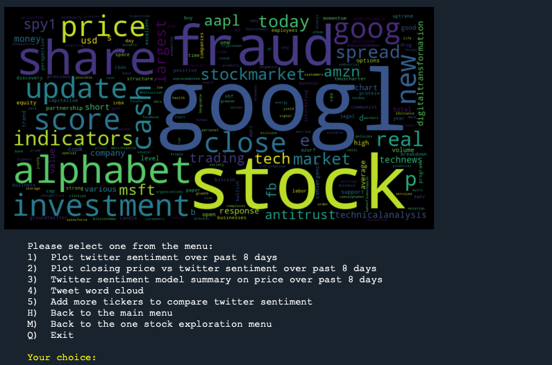
<br/><br/>

Finally, enter **Q** or **q** to exit the program when you are done.

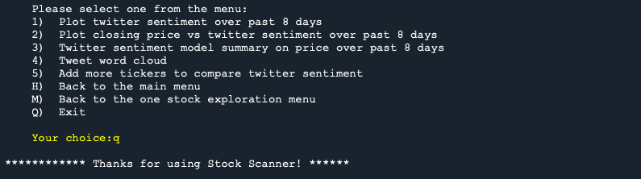
<br/><br/>

You can go back to start the program again simply by running the `group11_main.py` again in **Spyder**, and there is a lot more menu options you can choose to explore.
<br/><br/>

## **csv filename explanation**
When you start the program and choose any options to see a plot or a summary, related data will be saved as csv in the same folder as `group11_main.py` in your computer.

### Possible csv file name examples:
* `AMZN_HisNews_20201208_p30.csv` contains historical news headlines data about ticker AMZN, where the news extraction date is Dec 08 2020 and the user asked for 30 pages of news headlines.
* `GOOGL_HisPrice_20200501_20201207.csv` contains historical price data about ticker GOOGL, where the price inquiry start date is May 01 2020 and end date is Dec 07 2020.
* `GOOGL_Tweets_20201208.csv` contains recent tweets data about ticker GOOGL, where the stock tweet extraction date is Dec 08 2020.
* `GOOGL_Stats_20201206.csv` contains company profile data about ticker GOOGL, where the profile data extraction date is Dec 06 2020. 

### <ins>note</ins>:
* If a user explores the same ticker but on a ***different*** date, new csv files will be generated with a different date noted in the file name and saved in your folder.
* If a user explores the same ticker on the ***same*** date:
    * Twitter related file will not be recreated if it is already there
    * More news related file may be generated with a different name, **if** the user asks for a different number of page of news to extract.
    * More price related file may be generated with a different name, **if** the user enters a different date range for price inquiry.
<br/><br/>

## **Sample Data File Usage**
If certain task takes longer than you expected to run (such as loading tweets, or loading news from Business Insider, or simply Business Insider website goes down), please use the sample files that came with this program package.

I have included several news and tweets related file in the folder, but no price related sample files.

### **Detailed Instructions to use**:
When you want to use the sample files:
1. please change the date to Today's date in *yyyymmdd* format in the file name.
2. remember the ticker names that was mentioned in the name of sample files, and the number of page of news extracted that is mentioned in the file name.
3. Go back to Spyder and start running `group11_main.py` 
4. If you want to see news related plots/summary: enter the same number of page of news as what it was mentioned in the sample file name, and enter the same tickers that were from the file name
5. If you want to see tweets related plots/summary: only enter the ticker symbols you see from the sample file. If you enter any ticker that has no sample file stored, the program will have to extract all the tweets alive.


### **Example**:
I have included sample news csv file like `FB_HisNews_20201212_p10.csv` and `WMT_HisNews_20201212_p10.csv` in the folder. Both files were extracted on Dec 12 2020 and **10** pages of news headlines were extracted. If you plan to use the same file on a date like Dec 16 2020, please first change the file name to `FB_HisNews_20201216_p10.csv` and `WMT_HisNews_20201216_p10.csv`. When running the main program `group11_main.py`, please make sure you are only asking for **10** pages of news headlines from ticker **FB** and **WMT** only  (i.e. you can either analyze these 2 tickers' news separately, or compare news sentiment between **2** tickers at most).

I have also included tweets csv file like `GOOGL_Tweets_20201212.csv`, `FB_Tweets_20201212.csv` and `AMZN_Tweets_20201212.csv`, where  all tweets were extracted on Dec 12 2020. If you plan to use the same file on a different date like Dec 31 2020, please replace `20201212` with `20201231` in all 3 file names.  And when you run the main program `group11_main.py`, please make sure you are only asking tweets from tickers **GOOGL**, **FB**, and **AMZN**  (i.e. you can either analyze these 3 tickers' tweets separately, or compare tweets sentiment between **3** tickers at most).

## **License**
[MIT](https://choosealicense.com/licenses/mit/)
 